Collection of generative methods in pytorch.

# Implemented models
* [Attend, Infer, Repeat: Fast Scene Understanding with Generative Models](https://arxiv.org/abs/1603.08575v3)
* [DRAW: A Recurrent Neural Network For Image Generation](https://arxiv.org/abs/1502.04623.pdf)
* [Semi-Supervised Learning with Deep Generative Models](https://arxiv.org/abs/1406.5298)
* [InfoGAN: Interpretable Representation Learning by Information Maximizing Generative Adversarial Nets](https://arxiv.org/abs/1606.03657)
* [Unsupervised Representation Learning with Deep Convolutional Generative Adversarial Networks](https://arxiv.org/abs/1511.06434) (DCGAN)
* [Auto-encoding Variational Bayes](https://arxiv.org/abs/1312.6114)

The models are implemented for MNIST data; other datasets are a todo.

## Dependencies
* python 3.6
* pytorch 0.4.1
* numpy
* matplotlib
* tensorboardx
* imageio
* observations

Data should be symlinked into a `.data` folder or specified with data_path
flag (or the model can download the respective dataset if not available).


## AIR

Reimplementation of the Attend, Infer, Repeat (AIR) architecture.
https://arxiv.org/abs/1603.08575v3

#### Results
Model reconstructed data (top row is sample of original images, bottom row is AIR reconstruction; red attention window corresponds to first time step, green to second):

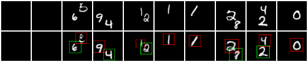

EBLO and object count accuracy after 300 epochs of training using RMSprop with the default hyperparameters discussed in the paper and linear annealing of the z_pres probability. Variance coming from the discrete z_pres is alleviated using NVIL ([Mnih & Gregor](https://arxiv.org/abs/1402.0030)) but can still be seen in the count accuracy in the first 50k training iterations.


| Variational bound | Count accuracy |
| --- | --- |
| 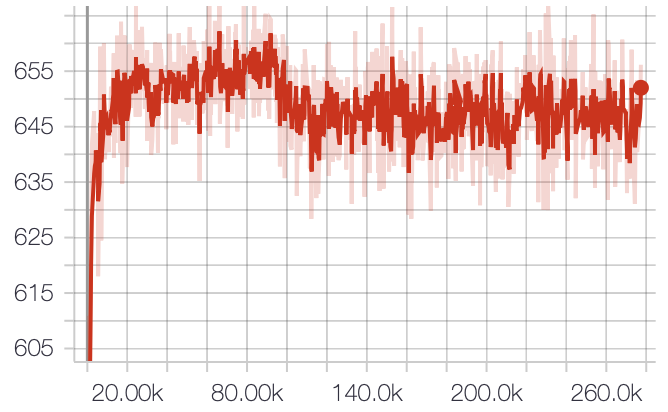 | 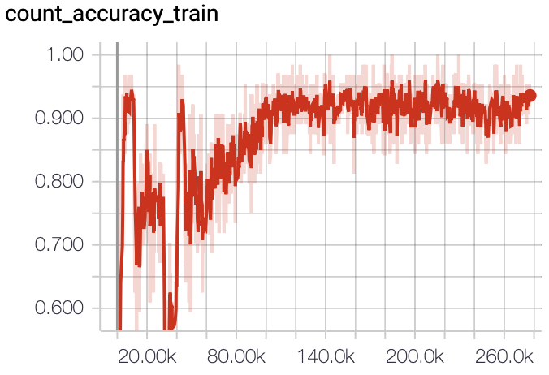

#### Usage
To train a model with hyperparameters of the paper:
```
python air.py -- train \
              -- cuda=[# of cuda device to run on]
```

To evaluate model ELBO:
```
python air.py -- evaluate \
              -- restore_file=[path to .pt checkpoint]
              -- cuda=[# of cuda device to run on]
```

To generate data from a trained model:
```
python air.py -- generate \
              -- restore_file=[path to .pt checkpoint]
```

Useful resources
* tensorflow implementation https://github.com/akosiorek/attend_infer_repeat and by the same author Sequential AIR (a state-space model on top of AIR) (https://github.com/akosiorek/sqair/)
* pyro implmentation and walk through http://pyro.ai/examples/air.html

## DRAW
Reimplementation of the Deep Recurrent Attentive Writer (DRAW) network architecture. https://arxiv.org/abs/1502.04623

#### Results
Model generated data:

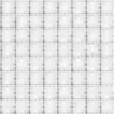

Results were achieved training at the parameters presented in the paper (except at 32 time steps) for 50 epochs.

Visualizing the specific filterbank functions for read and write attention (cf Figure 3 & 4 in paper):

| Extracted patches with grid filters | Applying transposed filters to reconstruct extracted image patch |
| --- | --- |
| 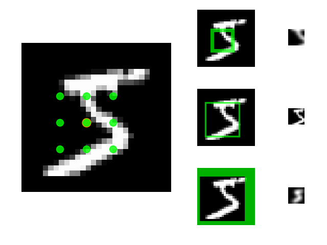 | 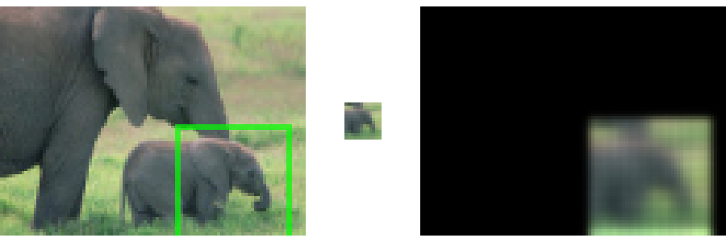

#### Usage
To train a model with read and write attention (window sizes 2 and 5):
```
python draw.py -- train \
               -- use_read_attn \
               -- read_size=2 \
               -- use_write_attn \
               -- write_size=5 \
               -- [add'l options: e.g. n_epoch, z_size, lstm_size] \
               -- cuda=[# of cuda device to run on]
```

To evaluate model ELBO:
```
python draw.py -- evaluate \
               -- restore_file=[path to .pt checkpoint]
               -- [model parameters: read_size, write_size, lstm_size, z_size]
```

To generate data from a trained model:
```
python draw.py -- generate \
               -- restore_file=[path to .pt checkpoint]
               -- [model parameters: read_size, write_size, lstm_size, z_size]
```

#### Useful resources
* https://github.com/jbornschein/draw
* https://github.com/ericjang/draw


## Semi-supervised Learning with Deep Generative Models
https://arxiv.org/abs/1406.5298

Reimplementation of M2 model on MNIST.

#### Results
Visualization of handwriting styles learned by the model (cf Figure 1 in paper). Column 1 shows an image column from the test data followed by model generated data. Columns 2 and 3 show model generated styles for a fixed label and a linear variation of each component of a 2-d latent variable.

| MNIST analogies | Varying 2-d latent z (z1) on number 2 | Varying 2-d latent z (z2) on number 4 |
| --- | --- | --- |
| 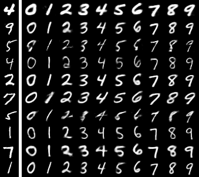 | 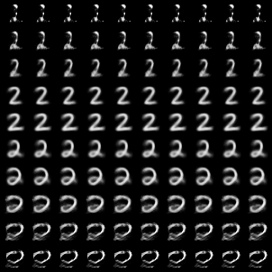 | 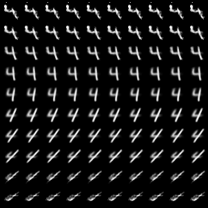

#### Usage
To train a model:
```
python ssvae.py -- train \
                -- n_labeled=[100 | 300 | 1000 | 3000] \
                -- [add'l options: e.g. n_epochs, z_dim, hidden_size] \
                -- cuda=[# of cuda device to run on]
```

To evaluate model accuracy:
```
python ssvae.py -- evaluate \
                -- restore_file=[path to .pt checkpoint]
```

To generate data from a trained model:
```
python ssvae.py -- generate \
                -- restore_file=[path to .pt checkpoint]
```

#### Useful resource
* https://github.com/dpkingma/nips14-ssl


## InfoGAN

Reimplementation of InfoGan. https://arxiv.org/abs/1606.03657
This follows closely the Tensorflow implementation by [Depth First Learning](http://www.depthfirstlearning.com/2018/InfoGAN) using tf.distribution, which make the model quite intuitive.

#### Results

Visualizing model-generated data varying each component of a 2-d continuous latent variable:

| Varying 2-d latent z (z1)| Varying 2-d latent z (z2) |
| --- | --- |
| 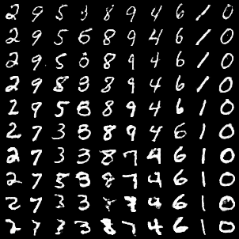 | 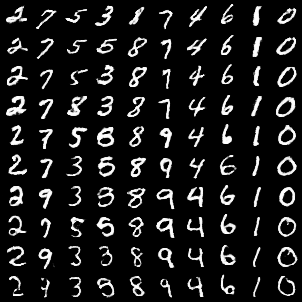

#### Usage
To train a model with read and write attention (window sizes 2 and 5):
```
python infogan.py -- n_epochs=[# epochs] \
               -- cuda=[# of cuda device to run on]
               -- [add'l options: e.g. noise_dim, cat_dim, cont_dim] \
```

To evaluate model and visualize latents:
```
python infogan.py -- evaluate_on_grid \
               -- restore_file=[path to .pt checkpoint]
```

#### Useful resources
* http://www.depthfirstlearning.com/2018/InfoGAN


## DCGAN

Reimplementation of DCGAN. https://arxiv.org/abs/1511.06434

#### Results
Model generated data:

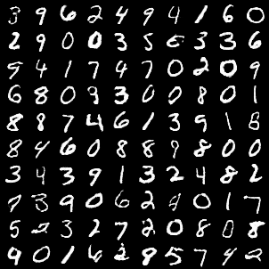

#### Usage
To train a model with read and write attention (window sizes 2 and 5):
```
python infogan.py -- n_epochs=[# epochs] \
               -- cuda=[# of cuda device to run on]
               -- [add'l options: e.g. noise_dim, cat_dim, cont_dim] \
```

To evaluate model and visualize latents:
```
python infogan.py -- evaluate_on_grid \
               -- restore_file=[path to .pt checkpoint]
```

#### Useful resources
* pytorch code examples https://github.com/pytorch/examples/


## Auto-encoding Variational Bayes
Reimplementation of https://arxiv.org/abs/1312.6114

#### Results

Visualizing reconstruction (after training for 25 epochs):

| Real samples (left) and model reconstruction (right) |
| --- |
| 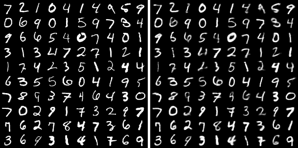 |

Visualizing model-generated data and TSNE embedding in latent space:

| Model-generated data using Normal(0,1) prior | TSNE embedding in latent space |
| --- | --- |
| 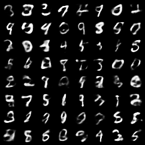 | 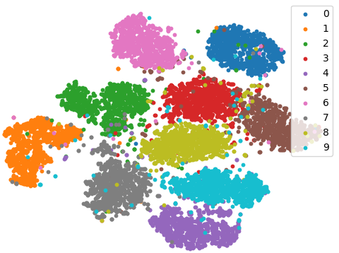 |


#### Usage
To train and evaluate a model on MNIST:
```
python basic_vae.py -- n_epochs=[# epochs] mnist
```

#### Useful resources
* Implementation in Pyro and quick tutorial http://pyro.ai/examples/vae.html
